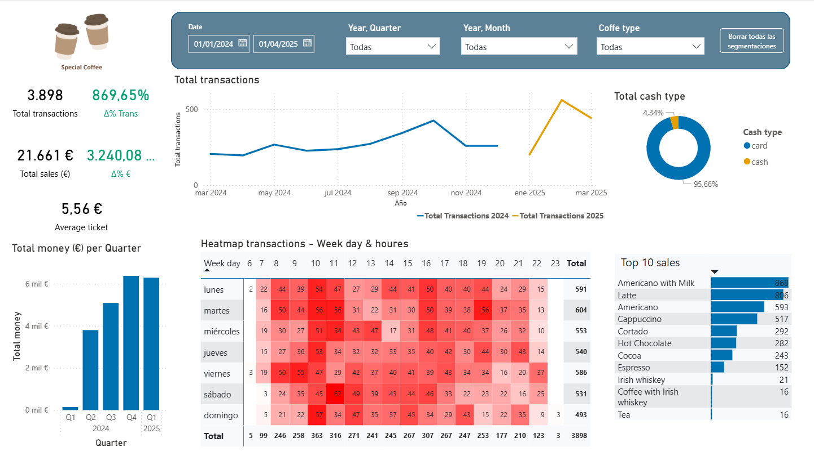

# ☕️ Dashboard de Ventas de Café (Power BI)

  

## 📚 Introducción
Este proyecto reúne un **dashboard de ventas de cafés** orientado a **monitorizar el rendimiento** y **optimizar decisiones de negocio**.  
El informe permite analizar volumen de transacciones, ventas, variaciones respecto al período anterior y desglose por productos, fechas y métodos de pago.

---

## 🎯 Objetivo
Construir un dashboard para el **seguimiento de ventas de cafés** y **apoyo a la toma de decisiones** (tácticas y estratégicas).

---

## 🧾 Datos
- **Fuente:** dataset descargado de **Kaggle**.  
- **Periodo cubierto:** del **01/03/2024** al **31/03/2024**.  
- **Tamaño:** **+3.500 registros**.

---

## 🛠️ Tecnologías y enfoque
**Stack 100% Power BI**
- **Power Query:** carga, limpieza y **estructura de los datos**.
- **DAX:** **medidas** de negocio y **tabla calendario**.
- **Modelado / Visualización:** herramientas nativas de **representación y diseño**.

---

## 📦 Contenido del repositorio
- **`Data/`**  
  Contiene **dos archivos CSV en bruto** (datos de origen sin transformar).

- **`Power_BI/`**  
  Archivo **`.pbix`** con el **dashboard** completo (modelado, DAX y diseño).

- **`Assets/`**  
  **Tema del informe** utilizado (colores/estilos para mantener coherencia visual).

---

## ▶️ Uso (rápido)
1. Abre **`Power_BI/<nombre_del_dashboard>.pbix`** con **Power BI Desktop**.  
2. Si es necesario, en **Archivo → Configuración de origen de datos**, actualiza las rutas de los CSV de `Data/`.  

---

## 📄 Estructura del dashboard

- **Slicers (Date, Year·Quarter, Year·Month, Coffee type, Reset):** filtran el período, el nivel temporal y el tipo de café que afecta a todo el informe.
- **KPIs**: **Total transactions** (número total de tickets); **Δ% Trans** (variación porcentual de transacciones vs. período anterior equivalente); **Total sales (€)** (ventas totales en euros); **Δ% €** (variación porcentual de ventas vs. período anterior equivalente); **Average ticket (€)** (ventas / número de tickets).
- **Línea – Total transactions 2024 & 2025:** evolución mensual de transacciones comparando años.
- **Donut – Total cash type:** distribución por método de pago (card vs cash) en el período filtrado.
- **Columnas – Total money (€) per Quarter:** ventas totales por trimestre para detectar estacionalidad.
- **Heatmap – Week day & hours:** intensidad de transacciones por día de la semana y franja horaria (picos/vales).
- **Barras – Top 10 sales:** ranking de productos con mayor volumen/ventas en el período seleccionado.

---

## ✨ Autor 
Proyecto realizado por **Jorge Alonso**. 
 &nbsp; [**Jorge Alonso Conde**](https://www.linkedin.com/in/jorge-alonso-conde)
