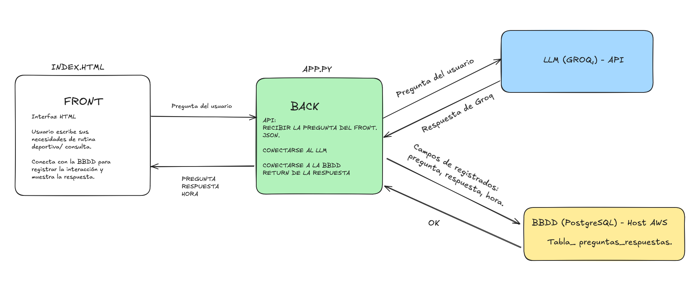

# 🏋️‍♂️ IA de Entrenamientos Personales (LLM)

  

## 📚 Introducción

Este proyecto desarrolla una **página de IA** basada en **LLM** especializada en **entrenamientos personales**. La aplicación ofrece dos experiencias complementarias:

- **Generador de rutinas completas**: un formulario que crea planes de entrenamiento personalizados según objetivos, tiempo disponible y frecuencia semanal.
- **Consultas concretas**: un apartado para preguntas rápidas (calentamientos, técnica, progresiones, etc.) con respuesta directa del modelo.

El flujo completo conecta **frontend (HTML)** → **API (Flask)** → **LLM (GROQ)** → **BBDD (PostgreSQL en AWS)**, registrando cada interacción (pregunta, respuesta y hora) y devolviendo la respuesta lista para el usuario.

---

## 🎯 Objetivos

- Construir una **API** que reciba preguntas, invoque al **LLM** y **registre** la interacción en la base de datos.
- Permitir al usuario **generar rutinas completas** y **resolver dudas puntuales** desde una interfaz simple.
- Mantener una **arquitectura clara** separando configuración, lógica de negocio, endpoints y presentación.
- Facilitar el **despliegue** y mantenimiento en un entorno gestionado (AWS + PostgreSQL).

---

## 🛠️ Tecnologías y estructura

**Tecnologías utilizadas**
- **AWS** (host de la base de datos).
- **PostgreSQL** y **pgAdmin 4** (gestión y administración).
- **Python**: **Flask** (API), **psycopg2** (conexión a PostgreSQL), **groq** (cliente de la API LLM).
- **HTML** (frontend generado con lovable.dev).

**Estructura lógica**
1. **Front (index.html)**: formulario para crear rutinas + caja de consultas rápidas.  
2. **Back (Flask)**: endpoints REST (p. ej. `POST /entrenamientos`) que reciben `{"pregunta": "..."}`
3. **LLM (GROQ)**: genera la **respuesta** adaptada al contexto fitness.  
4. **BBDD (PostgreSQL en AWS)**: persiste `pregunta`, `respuesta`, `hora`.  
5. **Respuesta al Front**: renderizado de la respuesta y confirmación de registro.

---

## 📦 Contenido del repositorio

- **app.py**  
  API con **Flask**: define y expone los endpoints (p. ej. `POST /entrenamientos`).  
  Orquesta el flujo: recibe el JSON con `pregunta`, llama al **LLM**, registra en BBDD y devuelve:  
  - Éxito: `{"pregunta": "...", "respuesta": "..."}`  
  - Error controlado: `{"error": "Error de la pregunta"}`

- **variables.py**  
  Variables necesarias para que `app.py` funcione correctamente. Contiene la configuración de la **BBDD** (host, puerto, nombre, usuario y contraseña) y la **API key** del proveedor LLM (**oculta**/no versionada).

- **funciones.py**  
  Lógica reusable de la API:  
  - `llm(pregunta)`: invocación a la API de **GROQ** y formateo de la respuesta.  
  - `bbdd(pregunta, respuesta)`: inserción en **PostgreSQL** de los campos `pregunta`, `respuesta`, `hora`.

- **notebooks/**  
  **Memoria de desarrollo** donde se prototipó la conexión a la API LLM y se validó el flujo previo al despliegue en `app.py`.

- **index.html**  *(Generado con lovable.dev).*
  - **Frontend** para interactuar con la IA personalizada:  
  - Formulario de **rutinas completas**.  
  - Apartado de **preguntas rápidas**.  

- **test.py**  
  Comprobación mínima del endpoint principal (`POST /entrenamientos`) enviando `{"pregunta": "..."}` y validando la respuesta.

- **Flujo Completo.png**  
  Diagrama visual del flujo end-to-end de la solución.

---

## ✨ Autor

Proyecto realizado por **Jorge Alonso** para fines de práctica en análisis de datos con Python y visualización.

 &nbsp; [**Jorge Alonso Conde**](https://www.linkedin.com/in/jorge-alonso-conde)
